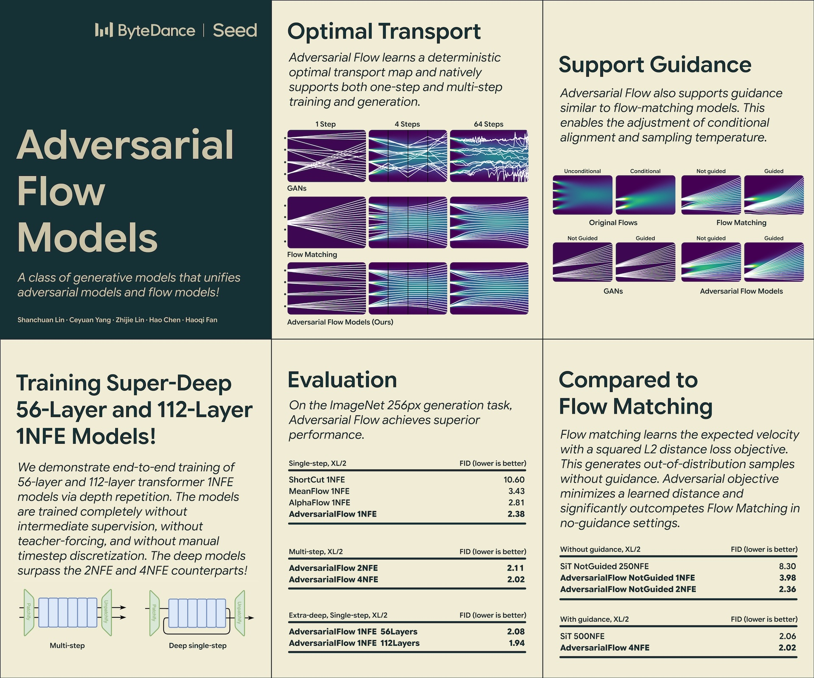

# Adversarial Flow Models

Official PyTorch implementation of Adversarial Flow Models.

> [**Adversarial Flow Models**](https://www.arxiv.org/abs/2511.22475)<br>
> [Shanchuan Lin](https://scholar.google.com/citations?user=EDWUw7gAAAAJ), [Ceyuan Yang](https://scholar.google.com/citations?user=Rfj4jWoAAAAJ), [Zhijie Lin](https://scholar.google.com/citations?user=xXMj6_EAAAAJ),  [Hao Chen](https://scholar.google.com/citations?user=QMuIRLYAAAAJ), [Haoqi Fan](https://scholar.google.com/citations?user=76B8lrgAAAAJ)
> <br>ByteDance Seed<br>



## Abstract
We present adversarial flow models, a class of generative models that belongs to both the adversarial and flow families. Our method supports native one-step and multi-step generation and is trained with an adversarial objective. Unlike traditional GANs, in which the generator learns an arbitrary transport map between the noise and data distributions, our generator is encouraged to learn a deterministic noise-to-data mapping. This significantly stabilizes adversarial training. Unlike consistency-based methods, our model directly learns one-step or few-step generation without having to learn the intermediate timesteps of the probability flow for propagation. This preserves model capacity and avoids error accumulation. Under the same 1NFE setting on ImageNet-256px, our B/2 model approaches the performance of consistency-based XL/2 models, while our XL/2 model achieves a new best FID of 2.38. We additionally demonstrate end-to-end training of 56-layer and 112-layer models without any intermediate supervision, achieving FIDs of 2.08 and 1.94 with a single forward pass and surpassing the corresponding 28-layer 2NFE and 4NFE counterparts with equal compute and parameters.

## Playground

Try [adversarial flow on 1D Gaussian mixture.](https://colab.research.google.com/drive/1qsRIKIVQgGm2YpkDxRHs-xIJzDvWKq_V?usp=sharing)

## Code

Please download [dit.py](https://github.com/facebookresearch/DiT/blob/main/models.py) from the original DiT repo and place it under `models/dit.py`, which is licensed under [Attribution-NonCommercial 4.0 International](https://github.com/facebookresearch/DiT?tab=License-1-ov-file#readme).

## Checkpoints
Download [checkpoints](https://huggingface.co/ByteDance-Seed/Adversarial-Flow-Models).
* `models/` Pre-trained ImageNet-256px checkpoints.
* `eval/` Pre-generated 50k samples used for FID evaluation. The npz format follows the evaluation script provided by [ADM](https://github.com/openai/guided-diffusion/tree/main/evaluations).
* `misc/` contains VAE and other checkpoints used in training.

## Generate
The generation configurations are provided in `/configs/generate`. Please download the pretrained checkpoint and change the yaml to point to the checkpoint. Run the command below to generate 50k samples for FID evaluation.
```bash
python3 main.py configs/generate/generate_1nfe.yaml
```
Or use multiple GPUs
```bash
TORCHRUN main.py configs/generate/generate_1nfe.yaml
```
Note that `TORCHRUN` denotes the `torchrun` command with your GPU configuration.

## Training
The training configurations are provided in /configs/train.
```bash
TORCHRUN main.py configs/train/train_1nfe.yaml
```

Our train scripts are refactored for public release and are provided for reference purposes. Our codebase was originally written to run on our internal platform, which uses the Parquet dataset format and uses wandb for logging. If you want to use our code for training, you may need to adapt the dataloading logic and logging logic to your own dataset and logging framework.

* We used Parquet format for storing and loading the dataset on HDFS. We packed 1,281,167 ImageNet training samples into 256 .parquet files; each .parquet file has 69 row groups. Our dataloading code loops over all samples in an infinite loop without the concept of an epoch. G and D updates are counted as separate iterations. So 1281167 / 256bs * 2iter = 10009 iter per epoch. 1m iterations is approximately 100 epochs.

* The training schedule is provided in Table 11 of the paper. The current approach still requires more manual intervention. This is a limitation we hope to improve in future work.

## About [ByteDance Seed Team](https://seed.bytedance.com/)
Founded in 2023, ByteDance Seed Team is dedicated to crafting the industry's most advanced AI foundation models. The team aspires to become a world-class research team and make significant contributions to the advancement of science and society.
